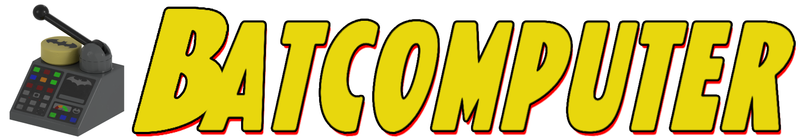

[](https://loomirr.github.io/Batcomputer/)

Batcomputer is a Windows modding tool for *LEGO Batman: Legacy of the Dark Knight*.
Build suits, customize equipment, and create new playable characters using assets from your own
copy of the game. Pick a base, make your changes, and build a mod to try in-game.

> **Current release:** `0.9.0-beta.10`
> **Documentation:** [loomirr.github.io/Batcomputer](https://loomirr.github.io/Batcomputer/)

This repository contains Batcomputer only. It does not contain game files, extracted assets, Oodle,
or Loomirr's LOTDK UE4SS.

## What it does

The development build adds [custom characters](https://loomirr.github.io/Batcomputer/guides/custom-characters/)
with their own suits, a [custom equipment workshop](https://loomirr.github.io/Batcomputer/guides/equipment-workshop/),
and experimental [skinned-mesh imports using existing game rigs](https://loomirr.github.io/Batcomputer/guides/skeletal-mesh-proof/).
These are still being tested for the next release, so they may not be in the current download yet.
Use the [release test checklist](https://loomirr.github.io/Batcomputer/guides/release-test-checklist/) if you're testing a development build.

- Build a suit from a visual base and a playable gameplay donor.
- Add parts, capes, gliders, materials, textures, and custom OBJ attachments.
- Preview the model in 3D and save custom-part placement and UV adjustments.
- Import cooked animation packs into a shared library, then replace individual animations.
- Change abilities and fighting styles, with checks for required equipment and compatible animations.
- Add held items separately from the fighting style.
- Customize supported equipment models, projectiles, and icons.
- Create a new playable character and give it its own suits.
- Package characters and suits together, install the mod, or export a ZIP to share.

Extra effects and status-effect experiments are on hold until the reported crashes are resolved.

## Requirements

### To make mods

- A local installation of *LEGO Batman: Legacy of the Dark Knight*.
- A matching `.usmap` file for the current game build.
- Unreal Engine 5.6 to build the Asset Registry data used by new mods.
- Loomirr's LOTDK UE4SS 0.1.1 or newer installed in the game.

### To make smaller packages

Batcomputer includes an Oodle-capable `retoc` helper. Compact Oodle packages additionally require a
user-selected `oo2core_9_win64.dll` from a local UE 5.6 installation. The runtime DLL is never
copied into a mod, release ZIP, or this repository.

### To use finished mods

Players only need the finished mod and Loomirr's LOTDK UE4SS 0.1.1 or newer. They do not need Batcomputer, .NET,
Unreal Engine, mappings, or extracted game assets.

## Portable layout

Extract a portable release somewhere writable, such as `C:\Tools\Batcomputer`.

```text
Batcomputer/
  Batcomputer.exe
  Generated/       build output, suit projects, previews, and extracts
  Data/            reusable indexes and the writer cache
  Runtime/         local runtime state
  Tools/           retoc and the verified Asset Registry writer
```

The default workspace stays beside `Batcomputer.exe`. Settings can move the workspace or the large
extracted game dump to another drive.

## First run

Setup asks for the game Paks folder, mappings, and other local paths. When UE 5.6 is configured,
setup verifies the bundled Asset Registry writer once. Later mod builds reuse that local writer
until its source or the configured UE build changes.

Setup can then run the full character extraction. It reads the game's original Paks plus installed
`Content\DLC` and `/Game/AdditionalContent` sources, while ignoring user mods under nested `~mods`
folders. The standard all-character extraction includes character, animation, localisation, and
character-supporting gadget assets and needs about 18 GB of free space.

For the complete walkthrough, see the
[first-time setup guide](https://loomirr.github.io/Batcomputer/getting-started/setup/).

## Loomirr's LOTDK UE4SS

Install Loomirr's LOTDK UE4SS separately. Batcomputer puts each mod's `mod.json` under
`ue4ss\LOTDKExpanded\Mods` and its registry plugin under
`ue4ss\LOTDKExpanded\RegistryPlugins`. Loomirr's LOTDK UE4SS supplies the shared
`LOTDKExpandedCoreRegistry` plugin that keeps the Asset Manager scanning `/Game/Mods`. Mod archives
contain only their own registry rows, gameplay tags, manifest, and cooked assets; they never
overwrite the shared registry. Batcomputer does not modify the runtime DLL or `mods.txt`.

## Build a suit

1. Create or open a mod.
2. Add a suit, then choose a visual base and a playable donor.
3. Confirm the detected native body profile, or choose another exact shipped Minifig/Smallfig body
   before adding replacement parts. The shared native skeleton is automatic.
4. Use the part, material, texture, equipment, and animation tools to assemble the suit.
5. Set the native identity and review the donor-based menu icons.
6. Use the 3D viewer to inspect the assembled character. Normal game-part placement is preview-only;
   custom OBJ scale, position, rotation, and UV changes can be saved and **Baked to game**.
7. Run **Check mod**, then select **Build Mod**.

Every export is a mod, including a mod containing one suit. **Build Mod** creates the release and
installs it into the configured game folders. Restart the game before testing a newly built mod.

The documentation includes a full
[first-suit tutorial](https://loomirr.github.io/Batcomputer/guides/first-suit/),
[update and repair guide](https://loomirr.github.io/Batcomputer/guides/update-repair-suit/),
[materials and faces guide](https://loomirr.github.io/Batcomputer/guides/materials-textures-faces/),
[character animation guide](https://loomirr.github.io/Batcomputer/guides/animations/),
[suit abilities guide](https://loomirr.github.io/Batcomputer/guides/abilities/),
[equipment workshop guide](https://loomirr.github.io/Batcomputer/guides/equipment-workshop/),
and [troubleshooting checklist](https://loomirr.github.io/Batcomputer/help/troubleshooting/).

## Equipment icons

Start with one white icon on a transparent background. In **Textures**, choose
**Equipment HUD icon (transparent PNG)** to convert it into a game-ready SDF texture.
Assign that same cook to the matching **HUD SDF / direct** and **HUD SDF / material** entries,
then save the equipment and rebuild. You don't need to draw a second colored image.

The prepared-SDF profile is for already encoded artwork; it does not convert a white PNG.
BCA color icons are a separate format, only for references labeled BCA. The current converter
is experimental: its output still needs checking in-game. See the
[icon setup steps](https://loomirr.github.io/Batcomputer/guides/equipment-workshop/#equipment-icons).

## Visual base and gameplay donor

The visual base controls the character's appearance. Any cutscene character can be used for this
purpose. The playable donor supplies the gameplay-facing data that a cutscene character may not
have, such as equipment and movement support.

This separation makes it possible to build visually from a wide range of characters without
guessing gameplay metadata.

## 3D viewer

The viewer lists built-in playable and cutscene characters plus suit projects in the current
workspace. It does not scan installed game mods, so content under the game's `~mods` folder
cannot change the base-game catalog or preview material resolution.

Generated 3D preview files are cleaned automatically by default. The cleanup setting can be changed
in Settings when a generated model or texture needs to be inspected.

Face materials appear in the viewer's **Material editor** as separate named regions. Pick a face
entry to see its Base, Normal, MMR, Emissive, Eye-spec, Teeth, and Tongue textures, or use **Solo
layer** to identify that region on the model. These controls affect only the preview.

For built-in **Playable** entries and modded suit projects, the viewer can also preview the base
game's Red Brick colours. The selector is hidden unless the assembled
body material has a usable Colour Mask, so a mask found only on an accessory cannot enable it. It is
never shown for Cutscene entries, and it does not create, package, register, unlock, or edit Red
Bricks. The normal character refresh extracts only the metadata needed to name these colour options.

## Build from source

Install the .NET 10 SDK, then run:

```powershell
dotnet build -c Release
dotnet run --project Batcomputer.csproj
```

The `Assets/` directory is not tracked. Release builds embed the artwork. A source
checkout without local artwork still runs with text and fallback glyphs.

## Legal

Batcomputer ships no game content. The bundled `gamedata` catalog contains reference metadata such
as package paths and class names, not textures, meshes, or cooked assets. Use assets from a locally
owned game installation and do not redistribute extracted game content.

Batcomputer is not affiliated with TT Games, Warner Bros. Games, or the LEGO Group.

## License

[MIT](LICENSE). See the [third-party notices](https://loomirr.github.io/Batcomputer/reference/third-party-notices/) for bundled dependencies.
