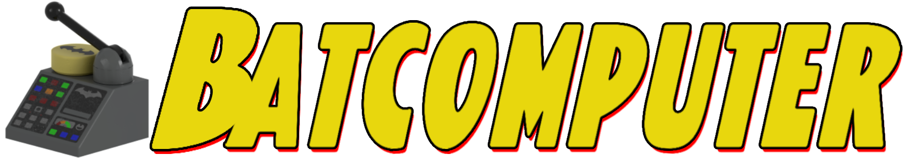

[](https://loomirr.github.io/Batcomputer/)

Batcomputer is a Windows tool for creating playable suit mods for
*LEGO Batman: Legacy of the Dark Knight*. It builds suits from character assets in your own copy of
the game, then packages and installs them.

> **Current release:** `0.9.0-beta.3`
> **Documentation:** [loomirr.github.io/Batcomputer](https://loomirr.github.io/Batcomputer/)

This repository contains Batcomputer only. It does not contain game files, extracted assets, Oodle,
or Loomirr's LOTDK UE4SS.

## What it does

- Starts a suit from a playable donor and any playable or cutscene character.
- Adds hair, hats, capes, torsos, accessories, equipment, and compatible animation data.
- Copies working game materials and applies new textures to individual mesh slots.
- Creates the PawnTag, DCMD, UIMD, StringTable, and Asset Registry data the game needs.
- Builds one or more suits into a single mod release.
- Installs the pak trio, PawnTags configuration, mod manifest, and registry plugin to the correct
  game folders.
- Creates an installable ZIP with the correct game folder layout.
- Includes a 3D preview with saved placement and UV adjustments for each part.

## Requirements

### To make mods

- A local installation of *LEGO Batman: Legacy of the Dark Knight*.
- A matching `.usmap` file for the current game build.
- Unreal Engine 5.6 to build the Asset Registry data used by new mods.
- Loomirr's LOTDK UE4SS 0.1.1 or newer installed in the game.

### To make smaller packages

Batcomputer includes an Oodle-capable `retoc` helper. Compact Oodle packages additionally require a
user-selected `oo2core_9_win64.dll` from a local UE 5.6 installation. The runtime DLL is never
copied into a mod, release ZIP, or this repository.

### To use finished mods

Players only need the finished mod and Loomirr's LOTDK UE4SS 0.1.1 or newer. They do not need Batcomputer, .NET,
Unreal Engine, mappings, or extracted game assets.

## Portable layout

Extract a portable release somewhere writable, such as `C:\Tools\Batcomputer`.

```text
Batcomputer/
  Batcomputer.exe
  Generated/       build output, suit projects, previews, and extracts
  Data/            reusable indexes and the writer cache
  Runtime/         local runtime state
  Tools/           retoc and the verified Asset Registry writer
```

The default workspace stays beside `Batcomputer.exe`. Settings can move the workspace or the large
extracted game dump to another drive.

## First run

Setup asks for the game Paks folder, mappings, and other local paths. When UE 5.6 is configured,
setup verifies the bundled Asset Registry writer once. Later mod builds reuse that local writer
until its source or the configured UE build changes.

Setup can then run the full character extraction. It reads only the game's original top-level Paks
containers and ignores nested `~mods` folders. The standard all-character extraction includes
character, animation, and localisation assets and needs about 18 GB of free space.

For the complete walkthrough, see the
[first-time setup guide](https://loomirr.github.io/Batcomputer/getting-started/setup/).

## Loomirr's LOTDK UE4SS

The required UE4SS package is installed separately. Batcomputer installs each mod's `mod.json` under
`ue4ss\LOTDKExpanded\Mods` and its registry plugin under
`ue4ss\LOTDKExpanded\RegistryPlugins`. Loomirr's LOTDK UE4SS supplies the shared
`LOTDKExpandedCoreRegistry` plugin that keeps the Asset Manager scanning `/Game/Mods`. Mod archives
contain only their own registry rows, gameplay tags, manifest, and cooked assets; they never
overwrite the shared registry. Batcomputer does not modify the runtime DLL or `mods.txt`.

## Build a suit

1. Create or open a mod.
2. Add a suit, then choose a visual base and a playable donor.
3. Use the part, material, texture, equipment, and animation tools to assemble the suit.
4. Set the native identity and review the donor-based menu icons.
5. Use the 3D viewer to inspect the assembled character. Placement and UV saves affect the viewer
   only; they do not alter the in-game character transform.
6. Run **Check mod**, then select **Build Mod**.

Every export is a mod, including a mod containing one suit. **Build Mod** creates the release and
installs it into the configured game folders. Restart the game before testing a newly built mod.

The documentation includes a full
[first-suit tutorial](https://loomirr.github.io/Batcomputer/guides/first-suit/),
[materials and faces guide](https://loomirr.github.io/Batcomputer/guides/materials-textures-faces/),
and [troubleshooting checklist](https://loomirr.github.io/Batcomputer/help/troubleshooting/).

## Visual base and gameplay donor

The visual base controls the character's appearance. Any cutscene character can be used for this
purpose. The playable donor supplies the gameplay-facing data that a cutscene character may not
have, such as equipment and movement support.

This separation makes it possible to build visually from a wide range of characters without
guessing gameplay metadata.

## 3D viewer

The viewer lists built-in playable and cutscene characters plus suit projects in the current
workspace. It does not scan installed game mods, so content under the game's `~mods` folder
cannot change the base-game catalog or preview material resolution.

Generated 3D preview files are cleaned automatically by default. The cleanup setting can be changed
in Settings when a generated model or texture needs to be inspected.

For built-in **Playable** entries and modded suit projects, the viewer can also preview the base
game's Red Brick colours. The selector is hidden unless the assembled
body material has a usable Colour Mask, so a mask found only on an accessory cannot enable it. It is
never shown for Cutscene entries, and it does not create, package, register, unlock, or edit Red
Bricks. The normal character refresh extracts only the metadata needed to name these colour options.

## Build from source

Install the .NET 10 SDK, then run:

```powershell
dotnet build -c Release
dotnet run --project Batcomputer.csproj
```

The `Assets/` directory is not tracked. Release builds embed the artwork. A source
checkout without local artwork still runs with text and fallback glyphs.

## Legal

Batcomputer ships no game content. The bundled `gamedata` catalog contains reference metadata such
as package paths and class names, not textures, meshes, or cooked assets. Use assets from a locally
owned game installation and do not redistribute extracted game content.

Batcomputer is not affiliated with TT Games, Warner Bros. Games, or the LEGO Group.

## License

[MIT](LICENSE). See [THIRD_PARTY_NOTICES.md](THIRD_PARTY_NOTICES.md) for bundled dependency notices.
