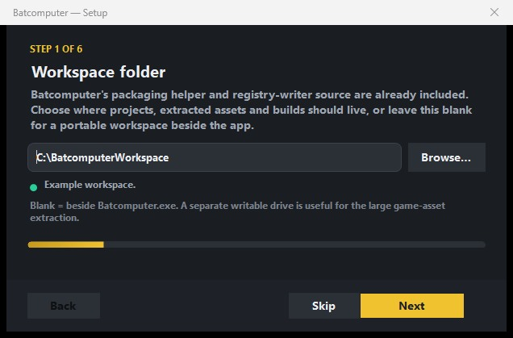

# First-time setup

Batcomputer opens a guided setup on first launch. You can run it again later from **Settings →
General → Run first-time setup again**.

{ .bc-doc-shot loading=lazy }

## 1. Workspace folder

Leave this blank to keep the workspace beside `Batcomputer.exe`, or select a writable folder on a
drive with enough space. The workspace contains your projects, extracts, indexes, previews, and
builds.

## 2. Mappings (`.usmap`)

Choose mappings made for the **currently installed game build**. Batcomputer copies the selected
file into its own `Data\Mappings` folder so the portable does not depend on a temporary download
location.

!!! warning "After a game update"
    Refresh the `.usmap`, then run a fresh character extraction before rebasing or packaging suits.
    Old cooked donors can parse successfully and still be incompatible with the updated game.

## 3. Game `Content\Paks` folder

Select:

```text
...\LEGOBatmanLotDK\Content\Paks
```

The extraction reads the game's original top-level containers. It ignores nested `~mods` content
so installed mods cannot contaminate the base-game donor index.

## 4. Extracted game Content

If you already have a current Content extraction, select it. Otherwise leave the field blank and
accept the full extraction offered at the end of setup.

The normal extraction includes character, shared animation, localization, supporting metadata, and
the equipment/glider materials stored under `Content/Models/Gadgets`. It uses roughly 18 GB and can
take several minutes.

Batcomputer reads the **active extracted Content** path shown in Setup. An old or empty
`ExtractedPakData` folder beside a previous portable build is not an extraction destination unless
you explicitly selected it.

## 5. Unreal Engine 5.6

Select the UE 5.6 installation root. Batcomputer verifies the bundled registry writer against that
editor's `BuildId` and reuses it for later builds. A matching Epic UE 5.6 installation does not need
to compile the writer.

If the editor has a different `BuildId`, Batcomputer falls back to compiling the included source and
reports any missing Visual Studio component by name.

You can skip UE while browsing and assembling, but you need it to build a mod.

## 6. Oodle runtime

For compact packages, select `oo2core_9_win64.dll` from your own UE 5.6 installation. Batcomputer
uses it locally and never copies it into generated mods or Batcomputer releases.

## Confirm the extraction

When setup finishes, choose **Extract assets**. Wait for all three milestones:

1. IoStore extraction completes without failed assets.
2. UAssetAPI validation completes without parse errors.
3. Template and part indexes rebuild successfully.

You are then ready to [create your first suit](../guides/first-suit.md).
