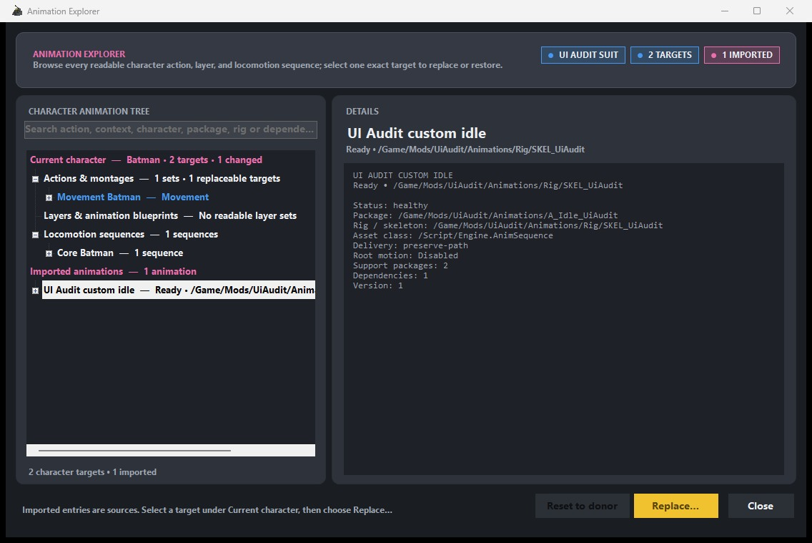
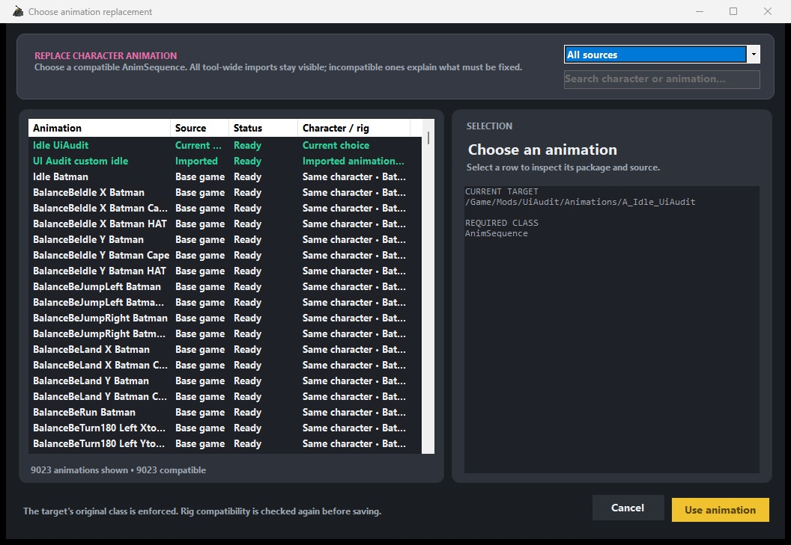

# Character animations

Batcomputer can replace one exact animation used by the current suit while leaving the gameplay
donor and every other character alone. The change is saved in that suit project and applied to its
own generated animation assets when you package it. It never rewrites the base-game animation.

## Explore a character's animation setup

Open **Animations** and choose **Edit character animations**. The Animation Explorer follows the
selected gameplay donor and groups its:

- Actions and context variants.
- Montage slots.
- Animation Blueprint layers.
- Locomotion sequences.
- Current suit overrides.

Select the exact row you want to change, then choose **Replace animation**. The picker keeps
base-game and imported sources separate and enforces the target asset class. **Reset to donor**
removes that one saved override and returns the row to the gameplay donor.

{ .bc-doc-shot loading=lazy }

Animation Blueprint layers are more tightly coupled to a character graph than ordinary sequences
or montages. Batcomputer labels cross-character layer swaps as experimental; test one in-game
before building the rest of a character around it.

An individual idle/walk/run override and a whole Locomotion layer swap cannot both own the donor's
`LAS_Default` controller. An exact layer edit inside that same default set has the same conflict.
Batcomputer stops the build and asks you to reset one side instead of packaging two competing
controllers.

## Import a cooked animation pack

Choose **Import animation pack**, then select the `.utoc`, `.ucas`, or `.pak` from the cooked
container. Batcomputer finds the matching files, verifies the container, rejects package paths that
would overwrite the installed game or DLC, and imports supported `AnimSequence` and `AnimMontage`
assets with their required cooked dependencies.

The imported library belongs to the whole Batcomputer workspace. An animation imported while one
suit is open is available when editing every other suit in that same workspace. The **Imported**
filter shows the complete library; a row that cannot satisfy the selected target remains visible
but disabled and explains its class, health, ownership, or missing-cache problem. A complete asset
on an unverified rig stays available only behind an explicit experimental warning, since a wrong
bone layout can crash when that pose starts.

{ .bc-doc-shot loading=lazy }

Imported package files are not copied into every build. Batcomputer stages an imported animation
and its required support packages only when the current suit references it.

## Safe test flow

1. Start with one sequence or montage on a duplicate test suit.
2. Confirm the target row, required class, source rig, and replacement in Animation Explorer.
3. Run **Check mod**, then build and install.
4. Fully restart the game and test the exact action plus nearby transitions.
5. Return to Animation Explorer and use **Reset to donor** if the source graph is not compatible.

Changing one row does not replace that animation globally. Another suit receives the same change
only if you explicitly assign it there too.
