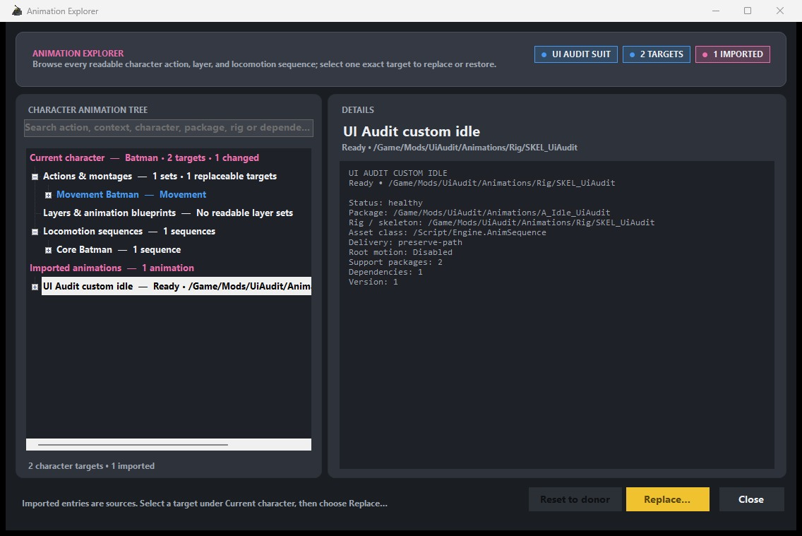
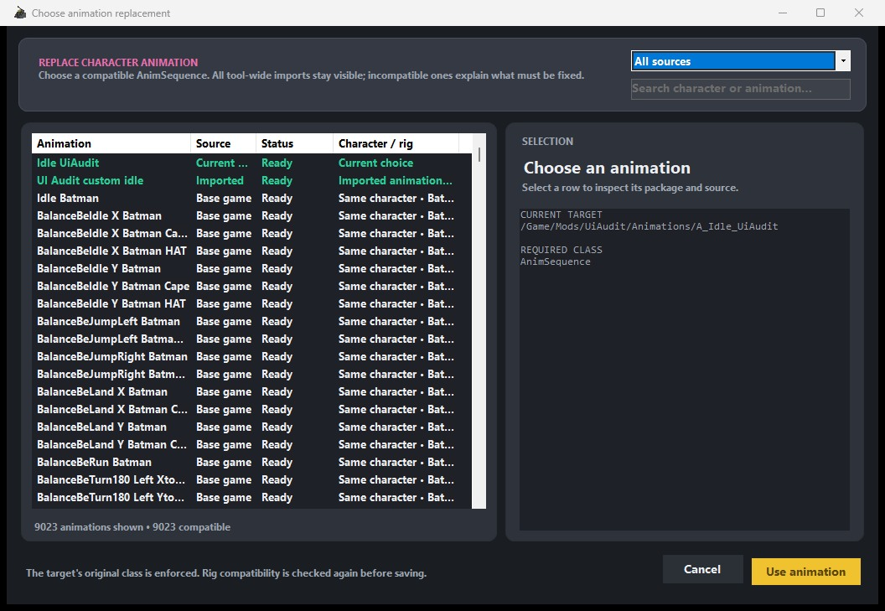

# Character animations

Batcomputer can replace one exact animation used by the current suit while leaving the gameplay
donor and every other character alone. The change is saved in that suit project and applied to its
own generated animation assets when you package it. It never rewrites the base-game animation.

## Explore a character's animation setup

For a first test, change one action on a backed-up suit, rebuild and trigger that exact action in-game.
Keep its movement, attacks and equipment unchanged until the replacement is working. Then test
the transitions into and out of the action, not just its first pose.

Open **Animations** and choose **Edit character animations**. The Animation Explorer follows the
selected gameplay donor and groups its:

- Actions and context variants.
- Montage slots.
- Animation Blueprint layers.
- Locomotion sequences.
- Current suit overrides.

Select the exact row you want to change, then choose **Replace animation**. The picker keeps
base-game and imported sources separate and enforces the target asset class. **Reset to donor**
removes that one saved override and returns the row to the gameplay donor.

{ .bc-doc-shot loading=lazy }

Animation Blueprint layers are more tightly coupled to a character graph than ordinary sequences
or montages. Batcomputer labels cross-character layer swaps as experimental; test one in-game
before building the rest of a character around it.

An individual idle/walk/run override and a whole Locomotion layer swap cannot both own the donor's
`LAS_Default` controller. An exact layer edit inside that same default set has the same conflict.
Batcomputer stops the build and asks you to reset one side instead of packaging two competing
controllers.

## Pose and keyframe a draft in the 3D viewer

### Your animations

Open **Animations → Your animations** for the workspace's editable drafts and cooked clips.
Filter by **All your animations**, **On this character**, or **Cooked / ready**. Assignment badges
describe the current suit's configured slots; build/install the suit before expecting changes
in-game. Click a draft to open the current character directly in **Create** for preview/editing.
Right-click a draft for **Cook this draft**, or use **Edit character animations** to assign a
cooked version to a specific slot.

In the viewer's **Create** inspector, **Your animations** provides the same searchable draft list,
its status and the names of the slots using it. Choose **Preview / edit** without navigating to a
JSON file. **Save to your animations** stores a private workspace-owned copy; **Save draft JSON**
still exports a separate file. **Import animation draft** adds an existing JSON without changing
its original file. Cooking a draft automatically links its cooked version to this list.

Drafts and cooked versions are different: editing a draft does not replace the animation currently
on a suit. Older assigned versions stay visible; the edited draft is marked **cook again** until
you cook and deliberately assign the new version. Different-rig drafts and missing sources stay
listed but cannot be opened on this rig. Dense clips retain all keys during playback; their
timeline/key buttons are reused rather than rebuilt on every frame.

Open a character's **3D viewer**, then choose **Create** in the inspector. This is a local animation
studio for the native LEGOfig body rig. It opens in rest pose and does not modify the suit, the game,
or an imported animation. The parts list folds away to give the model and timeline more room; use
**Parts** if you need to inspect it while editing.

1. Name the clip, describe its intended use, and set its length (30 frames per second, up to 30 seconds).
2. Choose a bone from the searchable hierarchy. **Show joints** makes its joint markers clickable in
   the 3D view, and **Focus joint** centers the camera on the selected bone.
3. At the desired frame, use **Move**, **Rotate**, or **Scale** on the joint gizmo. The numeric fields
   show the selected bone's offset from its rest pose; they are not world-space coordinates. Scale
   is a multiplier of the bone's rest size (1 means unchanged), limited to 0.05–5 per axis. Choose
   local or world axes and turn on snapping when you need precise increments.
4. Use **Set key**, **Key rest pose**, or the transform controls to make keys. Drag a diamond in the
   timeline to retime it; copy/paste a key to another bone or frame; use **Undo/Redo** to correct an
   edit. A key's **Transition** can be linear, smooth, or held until the next key.
5. Scrub the timeline or use frame stepping, playback speed, looping, the frame number, and timeline
   zoom to inspect the motion. Save the draft JSON and reopen it later on the same native rig. Use
   **New draft** for another clip; it warns before discarding unsaved work.

Drag the small grip on the timeline's top edge to make the track area taller or shorter. Its height
is remembered. With the grip focused, Up/Down changes the height by keyboard.

Useful shortcuts while the 3D viewport has focus: `W` moves, `R` rotates, `E` scales, `K` adds a key,
Space starts or pauses, Left/Right steps one frame (Shift steps five), and Ctrl+Z/Ctrl+Y undo/redo.

### Edit motion from an existing clip

In **Motion**, select and load a body animation, then open **Create** and choose
**Edit selected Motion clip**. Batcomputer samples the displayed CharacterMesh0 motion at 30 fps
into editable native-rig keys. Adjust the joints, retime keys and save a new draft. The original
animation remains untouched. Body clips must be 0.1–30 seconds; face, cape and montage-only clips
are not imported into this body editor. Gameplay notifies are not copied with the pose samples.

Drafts are limited to 2 MB for both reopening and cooking. Saved values retain eight decimal
places; compact JSON avoids storing viewer floating-point noise. An oversized draft stays unsaved
and explains that the clip needs shortening or unused keys need removing. Dense imported key
lists scroll inside their own area so the remaining controls stay reachable.

### Plan combat timing in the viewer

**Combat timing · preview draft** adds named windows to the same animation timeline. Choose the
right hand, left hand or both, then set **Start**, **Contact** and **End** by frame number, by
**Use playhead**, or by dragging the three orange timeline handles. Start must precede End, with
Contact inside that interval. Scrubbing/playing shows which windows are active against the pose.
Windows support Undo/Redo and survive saving/reopening the draft; up to 16 windows are supported.

These are **preview planning markers, not in-game hitboxes or damage events**. Native LOTDK
hit-frame/hitbox notifies also encode sockets, combat metadata and damage effects. Their gameplay
adapter is not implemented yet. Cooking a draft with nonempty combat windows stops with an
explanation rather than silently discarding the timing. Keep the timed authoring draft; make a
separate copy and explicitly remove the markers if you want to cook only its body motion now.

The editor saves a draft JSON first. To make it playable in a mod:

1. Save the draft from **Create** in the 3D viewer. Saving does not change the suit or game.
2. In Batcomputer's **Animations** page, choose **Cook animation draft** and select that JSON.
   Select a prepared, weighted native LEGOfig body FBX when asked. Configure Unreal Engine 5.6
   in Settings. Batcomputer validates the draft against the installed game's rig, cooks an
   `AnimSequence` in an isolated Unreal project, connects it to the native skeleton, and adds it
   to this workspace's animation library. You do not need to run Unreal commands yourself.
   Bone tracks are matched by name, with matching parents/rest transforms required. The final
   cooked poses are decoded and compared against the draft before library import; changing only
   a skeleton package path is not enough to validate a rig.
3. In **Edit character animations**, select the exact suit animation slot and choose the cooked
   library entry. Build the suit, then test that action in-game. No other slot is changed.

For the one-time FBX reference, export **native reference + rig (GLB)** from the skinned-mesh
workshop using the standard Minifig body. Follow the [Blender rig preparation guide](blender-rig-preparation.md)
and export the weighted reference geometry with its complete armature as one binary FBX. Keep
that reference locally; do not include the game's extracted model in a shared mod. A mismatched
rig is rejected before library import. The FBX is a temporary cook scaffold, not a replacement
mesh shipped with the animation.

The cooked sequence is stored in the workspace library and staged into a suit's pak only after
that suit references it. A cook does not install a mod automatically. If you change a draft and
cook it again, its content-hashed package name is new, so the previously assigned version stays
intact until you deliberately choose the new one.

One character can have several idle slots, and the game may not play them all in a short session.
Seeing one idle work does not prove that the other slots were selected or that every authored clip
has played. For a reliable in-game check, temporarily map each candidate to a known primary idle
slot on a disposable test suit and observe it separately.

## Import a cooked animation pack

Choose **Import animation pack**, then select the `.utoc`, `.ucas`, or `.pak` from the cooked
container. Batcomputer finds the matching files, verifies the container, rejects package paths that
would overwrite the installed game or DLC, and imports supported `AnimSequence` and `AnimMontage`
assets with their required cooked dependencies.

The imported library belongs to the whole Batcomputer workspace. An animation imported while one
suit is open is available when editing every other suit in that same workspace. The **Imported**
filter shows the complete library; a row that cannot satisfy the selected target remains visible
but disabled and explains its class, health, ownership, or missing-cache problem. A complete asset
on an unverified rig stays available only behind an explicit experimental warning, since a wrong
bone layout can crash when that pose starts.

{ .bc-doc-shot loading=lazy }

Imported package files are not copied into every build. Batcomputer stages an imported animation
and its required support packages only when the current suit references it.

## Safe test flow

### Character animation tree

Open **Character animation tree** on the Animations page. **Simple tree** groups readable
MAS/LAS targets by action category and keeps movement/idles together; **Native hierarchy**
retains the source-set structure. Reused assets remain separate targets when their action,
context, variant or owner differs. **Changed on this character** isolates saved replacements.

Select a target, then search the inline replacement list. Filter to **Your cooked clips** or
**Base game**, choose a compatible entry and press **Apply selected**. **Show unavailable
imports** explains why an imported entry cannot be selected. **Reset to donor** restores the
selected target. These actions retain the existing transactional suit-save and build path.

This browser describes readable animation sets and locomotion references, not the entire
gameplay ability state machine. Ability-owned combat graphs and their hitbox/notify contracts
are not yet editable here. A converted combat sequence alone is not a ready-to-use attack montage.

### Animation voice cues

In the animation editor, add a voice cue and choose its category and frame. For attack
efforts, **Play on empty swings** prevents the animation request from filtering that cue.
The character's voice routing, chance and cooldown still apply; this is not a damage event.
Save the draft, cook/import the animation, then assign it to the character and build the mod.
Existing drafts keep their previous filtering unless this option is enabled.

Voice Studio's **Volume · dB** adjusts assigned recordings for previews and future builds.
Boosts use peak limiting; imported WAV files stay unchanged. **Use for builds** selects
the saved voice profile. **Build mod** encodes its recordings and packages the private
voice routing with the suit; selecting a profile alone does not cook or install it.

### In-game checks

1. Start with one sequence or montage on a duplicate test suit.
2. Confirm the target row, required class, source rig, and replacement in Animation Explorer.
3. Run **Check mod**, then build and install.
4. Fully restart the game and test the exact action plus nearby transitions.
5. Return to Animation Explorer and use **Reset to donor** if the source graph is not compatible.

Changing one row does not replace that animation globally. Another suit receives the same change
only if you explicitly assign it there too.
