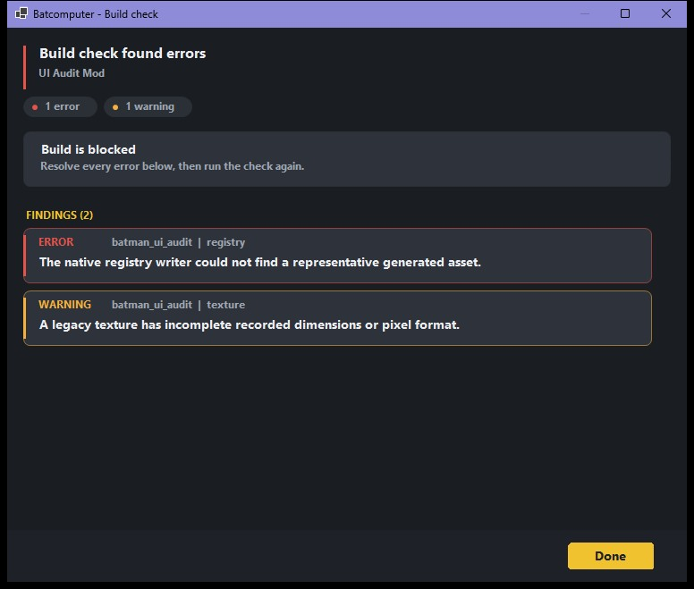
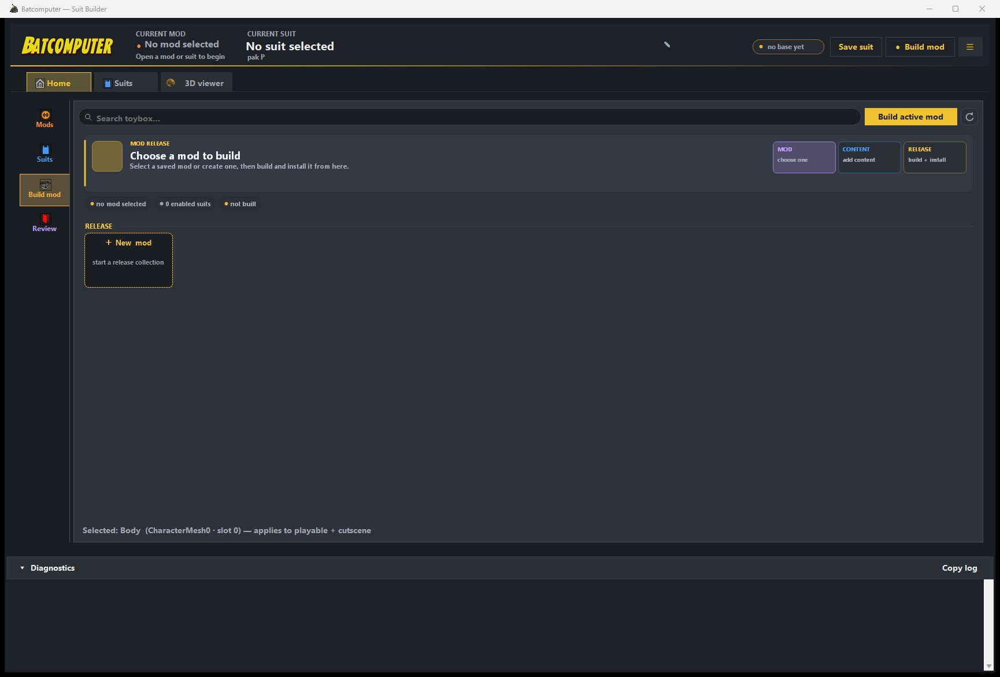
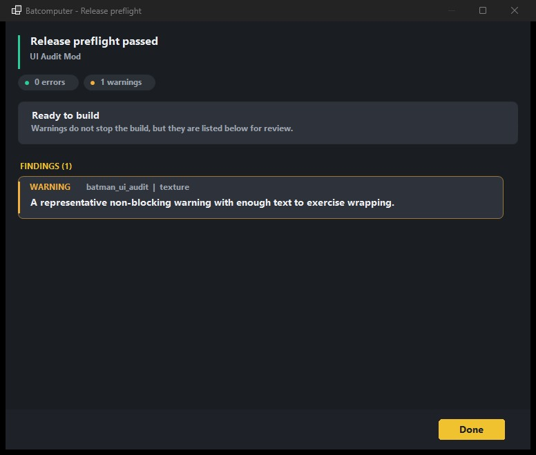

# Build, test, and share

## Run the build check

Open the mod and choose **Check mod**. Errors block packaging; warnings identify content that
needs review but may still be intentional.

Typical blockers include:

- Duplicate suit IDs, PawnTags, or DCMD package paths.
- Missing cooked texture payloads.
- Invalid or stale donor assets.
- Missing UIMD/DCMD/StringTable output.
- An unavailable Asset Registry writer.
- A third-party mod build with no compatible Loomirr's LOTDK UE4SS installation.

{ .bc-doc-shot loading=lazy }

## Build and install

Close the game before building, then choose **Build mod**:

{ .bc-doc-shot loading=lazy }

1. Stages every enabled suit and shared mod asset.
2. Validates the staged cooked data.
3. Writes gameplay tags and native Asset Registry data.
4. Builds the pak/ucas/utoc trio.
5. Installs the completed build into the configured game.

Batcomputer installs only a fresh, complete pak/ucas/utoc trio from the current build. If packaging
or installation fails, it does not publish a partial trio over the last working install.

Restart the game after each new installation. Unreal discovers tags, registry rows, and primary
assets during startup.

{ .bc-doc-shot loading=lazy }

## Test matrix

Test at least:

| Area | Check |
| --- | --- |
| Menu discovery | Correct character submenu, tile count, name, description, and icon. |
| Hover | Stable preview with the expected materials and parts. |
| Selection | Native swap animation and correct playable pawn. |
| Gameplay | Movement, equipment, glider, abilities, and animation behavior. |
| Persistence | Back out to frontend, reload gameplay, then fully restart the game. |
| Compatibility | Test beside at least one other custom suit mod using Loomirr's LOTDK UE4SS. |

## Create the ZIP

On **Home** → **Build mod**, choose the **Zip _mod name_** tile after a successful build. The archive
uses game-relative paths
and starts above `LEGOBatmanLotDK`, so users can extract it into their Steam `common` directory or
install it with a compatible mod manager.

Suit releases require Loomirr's LOTDK UE4SS. They must not include or overwrite its shared
`LOTDKExpandedCoreRegistry`.

## Before publishing

- Back up your project and source textures or OBJ files.
- Confirm the Mod ID is final.
- Include Loomirr's LOTDK UE4SS and the compatible game build in requirements.
- State that the release contains no Batcomputer, UE, mappings, or extracted game files.
- Provide a short list of included suits and known limitations.
- Cold-test the exact ZIP you intend to upload.

The ZIP is the thing to test and share. Do not replace files inside it after the final test; rebuild
the archive instead.
