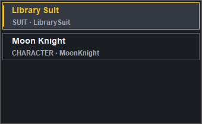
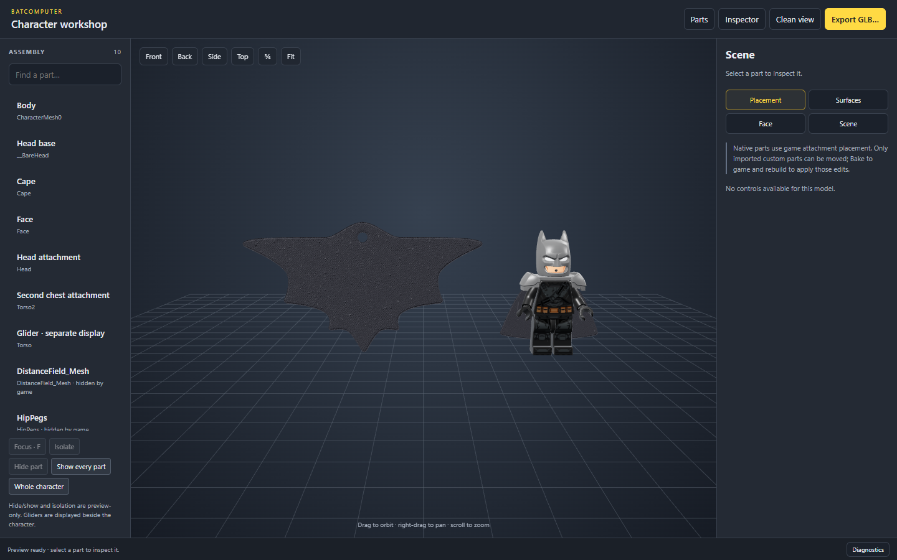

# Character 3D workshop

Open **View in 3D** for a saved suit or native character. The workshop combines a searchable
assembly list, camera controls and a part inspector. Drag to orbit, right-drag to pan and scroll
to zoom. Use the front/back/side/top views or **Fit** to inspect the whole assembly.

**My library** contains both saved character definitions and suits. Bordered rows are labeled
**CHARACTER** or **SUIT** with their ID so identically named projects remain distinguishable.
Search by name or ID; the count shows characters and suits separately.

{ loading=lazy }

{ .bc-doc-shot loading=lazy }

## Inspect the complete assembly

Select a part in the viewport or assembly list. **Focus** frames it; **Isolate**, **Hide part**
and **Show every part** affect the preview only, not the mod. Gliders are displayed beside the
character so their shape and materials remain visible. Some game-hidden helper meshes are listed
but hidden initially.

Native attachments use their game attachment transforms. There is no manual alignment control
for moving base-game parts. A glider's separate display position is not its in-game attachment.

## Materials, UVs and lighting

Use **Surfaces** to inspect a part's materials and change its preview UV set. **Face** exposes
the supported face-layer inspection controls. Preview UV changes do not rewrite the cooked mesh.

**Scene** provides lighting, exposure, floor grid and base-game Red Brick previews. These are
inspection tools, not new Red Brick mods. Compatible material families receive the preview;
unsupported shaders cannot be assumed to react in-game. Native detail/LEGO normal maps are used
where the viewer can resolve their material inputs; the renderer is an approximation of Unreal.

## Position imported custom parts

Select an editable custom static-mesh part and open **Placement**. Click the viewport before
using **W** (move), **E** (rotate) or **R** (scale). Shortcuts do not intercept typing in fields.
Use the gizmo or numeric values, snapping and undo/redo to adjust placement.

Placement changes are drafts until **Bake to game** succeeds. Then rebuild the mod and test in-game.
Native parts and rigged body bones are not movable through this custom static-part editor.

## Export a GLB

For an imported part that looks missing or incorrectly shaded, use the
[viewer troubleshooting checks](../help/troubleshooting.md#the-3d-viewer-is-blank) before changing
its rig or replacing its material. Preview visibility controls do not remove parts from a mod.

Choose **Export GLB…** to export the assembled preview for inspection in Blender. The exporter
includes its supported textures/materials and mesh UVs. Check appearance in Blender's Material
Preview; the exported result is not a full Unreal shader graph or a ready-to-import replacement
FBX. Preserve the original donor rig/rest pose when authoring a new game mesh.

For a weighted FBX replacement, export the **native reference + rig** from the
[skinned-mesh workshop](skeletal-mesh-proof.md), then follow the
[Blender preparation guide](blender-rig-preparation.md). That is a different export from this assembly GLB.

For sharing an editable Batcomputer project, use [Export editable copy](build-test-share.md#share-an-editable-project)
instead. A GLB is not a substitute for the saved mod recipes and import caches.
