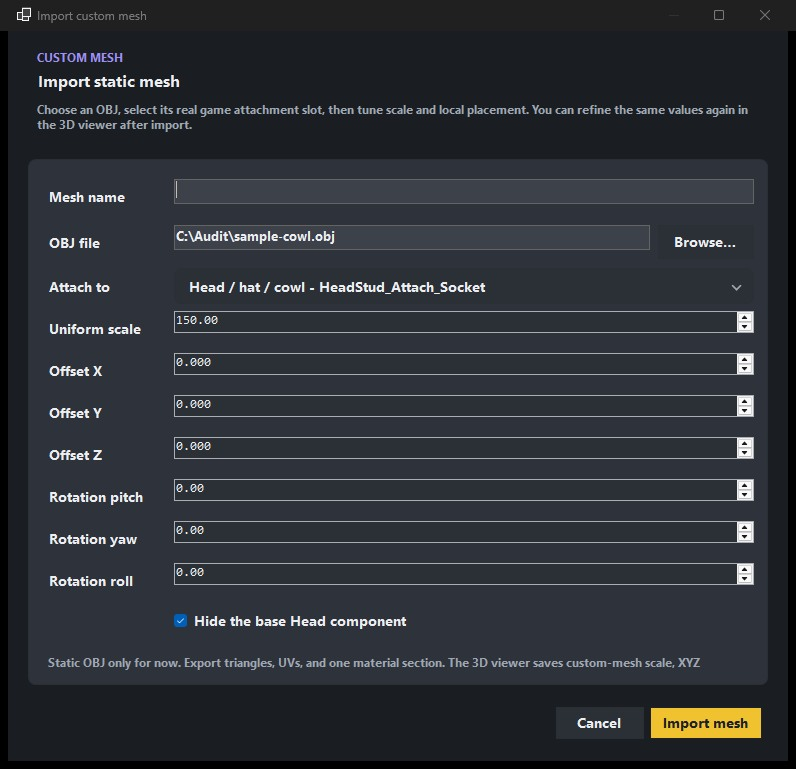

# Custom static meshes

Batcomputer can import supported OBJ geometry as a **static-mesh attachment**. This is intended for
items such as cowls and accessories that can follow an existing character socket.

## Import

1. Open **Parts** and start a custom mesh import.
2. Select the OBJ file.
3. Give the mesh a clear display and object name.
4. Choose the target component role and attachment socket.
5. Set the initial scale, offsets, and rotation.
6. Import, then open the suit in the 3D viewer.

Use the generated name shown by Batcomputer, not a temporary source filename or UUID, when reviewing
the component tree and material assignments.

{ .bc-doc-shot loading=lazy }

## Place the mesh

In the 3D viewer:

1. Select the custom mesh.
2. Adjust scale, X/Y/Z offset, pitch, yaw, and roll.
3. Select the intended UV channel when relevant.
4. Save the preview state.
5. Choose **Bake to game** before packaging.

Offsets use Unreal centimeters. The viewer converts them for preview, and the bake step
rebuilds the generated cooked mesh using the saved values.

The baked scale, position, and rotation stay in the suit recipe. A later native-part removal or
base replay should rebuild the custom mesh with those same values instead of returning it to the
original OBJ placement.

## Apply a material

Custom meshes expose material slots in the inspector. Generate or select a compatible material,
then drag or apply it to the custom mesh slot as you would for a normal game part. Reopen the 3D
viewer and confirm the material resolved on that mesh before baking.

For more than one material, assign faces to named materials in the OBJ before importing it. Each
distinct `usemtl` name becomes a separate Batcomputer slot in first-use order. For example, an OBJ
using `usemtl Black` and `usemtl Metal` exposes separate **Black** and **Metal** slots. Batcomputer
keeps an assignment with its exact material name when the OBJ is re-imported; removed names are
dropped and surviving slots are compacted. The referenced `.mtl` file is not used to create Unreal
materials, so apply cooked game or tool-created materials to the resulting slots yourself.

If a multi-material mesh was baked by an earlier beta, open it in the current build and choose
**Bake to game** again before packaging. The current build rewrites the cooked section and sampler
layout and verifies every slot before the mod can be installed.

For a textured cowl, use the paired custom-cowl template when possible. A paired template creates
separate gameplay and cutscene material instances; applying the pair to both contexts keeps each
Blueprint on the correct native material controller. The material keeps the donor shader's shared
LEGO micro-detail, so your imported OBJ only needs its own UVs and authored BC/MMR/normal maps.

## Edit or remove a custom mesh

Project-owned OBJ attachments have **Edit custom mesh** and **Remove from suit** actions in Parts.
Editing updates the saved recipe; removing the attachment also removes it from later suit rebuilds.
Keep an outside backup of the original OBJ even though Batcomputer keeps a project-owned source
copy.

If an edit fails while the suit is rebuilding, the previous project and generated stage stay in
place. Check Diagnostics for the first failed donor or file operation before trying again.

## Current limits

- OBJ static meshes only.
- Up to 64 named OBJ material sections per imported mesh.
- No custom skeletal-mesh cooking or skeleton transfer.
- No custom collision or physics setup.
- Geometry that does not fit the tested game-mesh template may be rejected.
- The viewer cannot reproduce every game shader, animation, or lighting condition.

Always test the baked result in-game before publishing.
