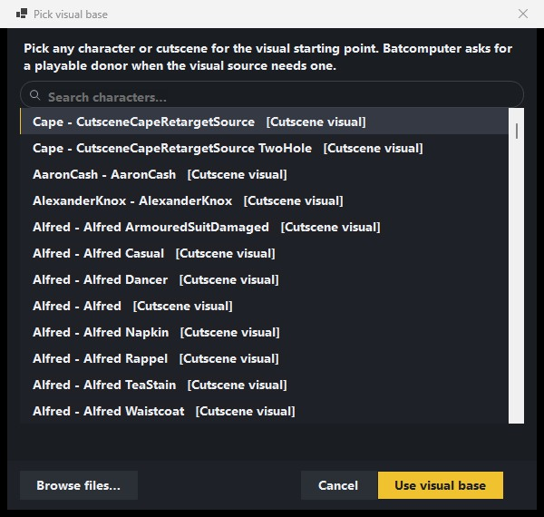
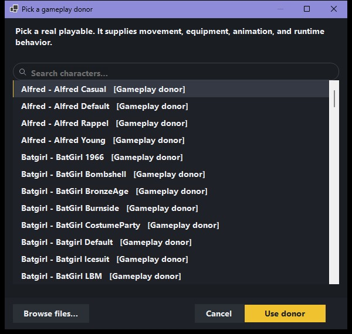
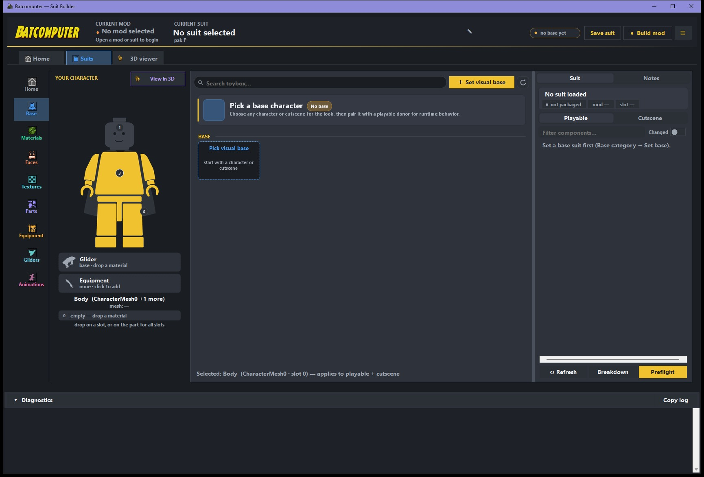
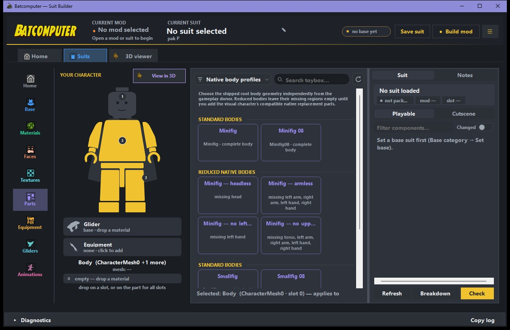
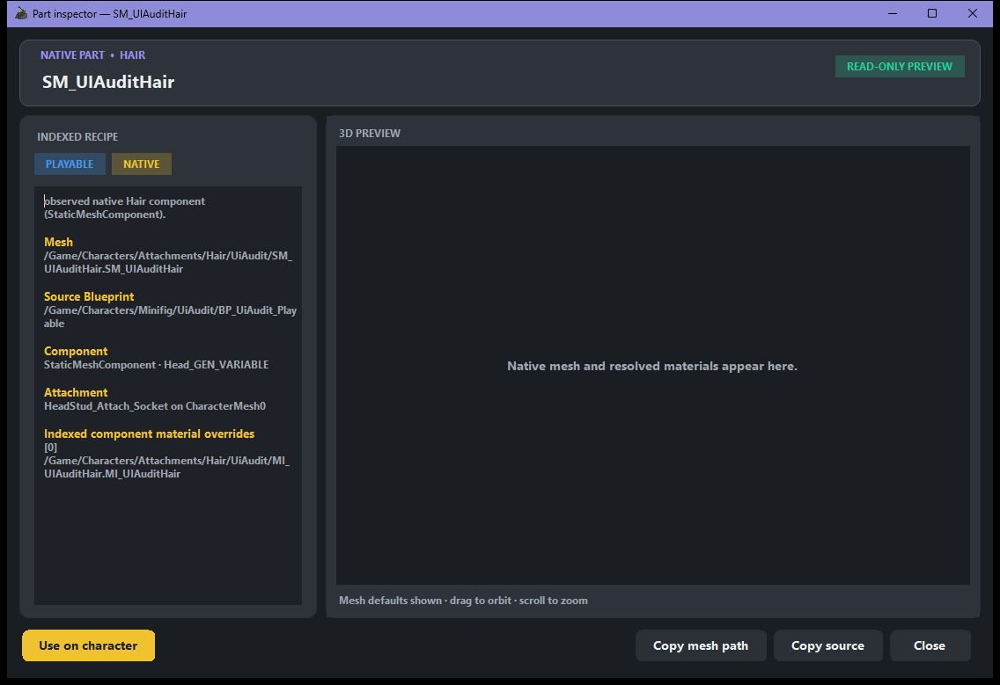

# Create your first suit

This tutorial starts with the game's existing assets. Test one simple suit in-game before adding
custom textures or meshes.

## 1. Create the mod

From **Home**, create a mod and set:

- **Display name:** the player-facing release name.
- **Mod ID:** a stable technical identifier with no spaces.
- **Description:** a short summary of the collection.

A mod can contain one suit or many suits. Shared files such as its StringTable are generated once
for the whole mod.

!!! danger "Do not casually rename a published Mod ID"
    The Mod ID controls pak, registry, StringTable, runtime-manifest, and install paths. Batcomputer
    can migrate a local project, but changing it after release is a breaking identity change.

## 2. Add a suit

Create a suit inside the active mod. Give it a unique suit ID and display name.

## 3. Choose the base and body

Batcomputer separates two jobs that the game often stores in different assets:

- **Visual base:** supplies the visible character assembly. This can be a playable, cutscene, or
  supported extracted `_Quest` character.
- **Gameplay donor:** supplies gameplay-facing playable behavior and metadata.

Use this order:

1. Open **Base** and pick the character whose appearance you want. This is the visual base.
2. If Batcomputer opens the playable picker, choose the character whose movement, combat,
   equipment, and normal animation style you want to keep. This is the gameplay donor. A cutscene,
   `_Quest`, or NPC visual is not a substitute for this playable donor.
3. Choose **Use as base** and wait for both generated character roles and the saved-edit replay to
   finish.
4. Open **Parts** → **Native body profiles**. Leave the detected profile selected for an ordinary
   character. Choose another profile only when the visual character really uses that shipped body,
   such as Minifig 08, Smallfig, headless, armless, no-left-hand, or no-upper-body.
5. For a reduced body, add the visual character's compatible native replacement parts after the
   body is selected. A missing region is intentional; Batcomputer does not invent geometry for it.

The body profile changes only the root `CharacterMesh0` geometry. It does not replace the gameplay
donor's animation class, collision, movement, equipment, or other runtime machinery. Every
supported Minifig and Smallfig profile already uses the game's shared `SKEL_LEGOfig` skeleton, so
there is no separate skeleton step or skeleton selector.

{ .bc-doc-shot loading=lazy }

{ .bc-doc-shot loading=lazy }

{ .bc-doc-shot loading=lazy }

{ .bc-doc-shot loading=lazy }

## 4. Customize the character

Use the left navigation:

- **Parts** — graft compatible hair, hats, capes, torsos, accessories, and other indexed components.
- **Materials** — copy working game materials and apply them to mesh slots.
- **Faces** — choose only recipes compatible with the selected face mesh family.
- **Textures** — import and cook body maps, face details, CT/RAO maps, masks, and UI icons.
- **Equipment / Gliders / Animations** — apply compatible data from another character, then test it
  in-game.

The right inspector shows the playable and cutscene component trees and their material slots.
Right-click a native part and choose **Inspect part in 3D** to see its mesh, attachment recipe, and
resolved default or component-override materials before applying it.

{ .bc-doc-shot loading=lazy }

### Give a glide-only character a regular cape

Use this order when the gameplay donor has a wingsuit or another glide-only visual, but the finished
suit should use a normal cape and a matching glide cape:

1. Refresh the native part index from the main menu if the donor parts were extracted recently.
2. Open **Gliders**, choose **Glider presets**, and filter to one native **Glide cape** donor.
3. Open that preset and choose **Use preset**. Batcomputer records the donor's complete glide
   setup, including the authored component, materials, visibility behavior, and body pose.
4. Open **Parts** and apply the regular cosmetic `Cape` from the exact same character variant as the
   glide preset. Right-click the part and choose **Apply to character**. Do not use a custom OBJ cape
   or a cape from another donor pair.
5. Batcomputer keeps the gameplay donor's appearance and normal movement, combat, and equipment,
   then uses the cape donor's matching animation while gliding.
6. Run **Check mod**, build, and cold-launch the game. Test standing cape visibility, glide opening,
   sustained flight, landing, and the character's normal combat/movement set.

The glide preset must be applied before the regular cape. Do not manually add the glide visual as a
Torso part; **Use preset** keeps the game's authored setup. If the exact donor pair cannot be
resolved, Batcomputer blocks the combination rather than building a double-cape or crash-prone suit.

## 5. Set identity and icons

Open **Native identity** and review:

- The unique PawnTag.
- The character family represented by the tag.
- The DCMD and UIMD identities.
- Display name and description StringTable entries.
- Menu, suit, left, and right icon paths.

The menu, left, and right character portraits use the 512px **Character icon** profile. The suit
selector tile uses the 256px **Suit selector icon** profile. Importing all four as 256px suit icons
can make the character-card portraits look wrong even when the suit tile is fine.

Use unique PawnTags and package paths. Duplicate identities are blocked by release validation.

## 6. Inspect in 3D

Open **3D viewer** and check the assembled body, face, materials, and attachments. The viewer is a
close preview, not the game's renderer.

For custom static meshes, transform edits save to the project and **Bake to game** rebuilds the
generated mesh. Placement controls for normal game parts affect only the preview.

## 7. Check and build

Return to the mod's Home page:

1. Choose **Check mod**.
2. Resolve every error. Read warnings instead of dismissing them automatically.
3. Close the game and tools that may hold output files open.
4. Choose **Build mod**.

A successful build creates the cooked release and installs it for local testing. A failed build
does not install an older trio in its place.

## 8. Cold-launch test

Fully exit and restart the game. Confirm:

- The suit appears under the intended character.
- Hovering it shows the correct icon, name, description, and preview.
- Selecting it swaps to the generated playable.
- Returning to the frontend and reloading gameplay preserves the selected suit.
- Materials, textures, equipment, glider, and animations behave as expected.

Once this works, continue with [Build, test, and share](build-test-share.md).

If an older suit no longer resolves its base or saved parts, use
[Update or repair a suit](update-repair-suit.md).
