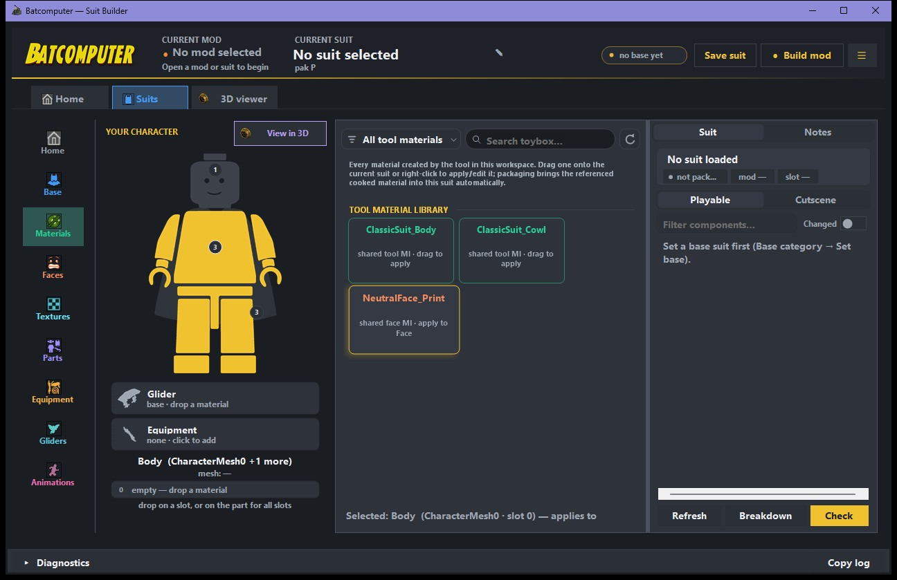
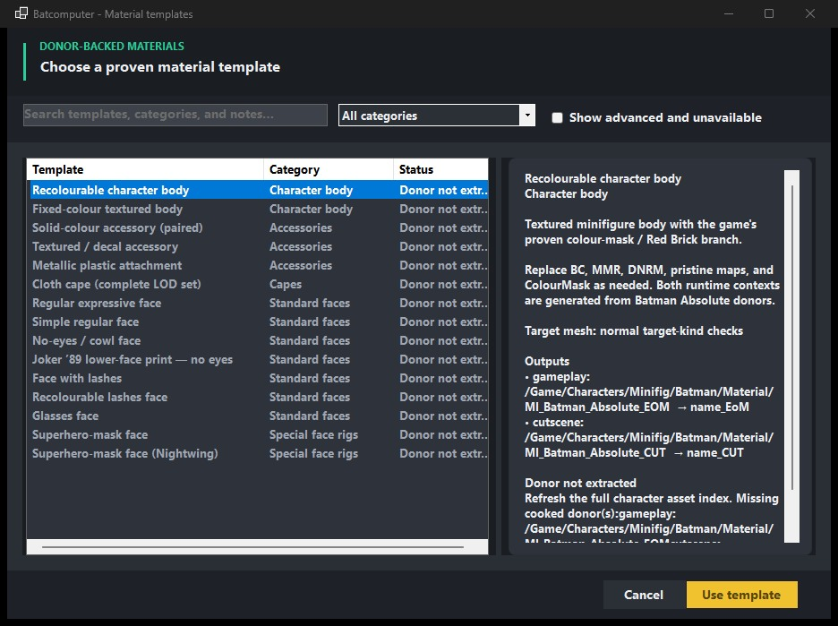
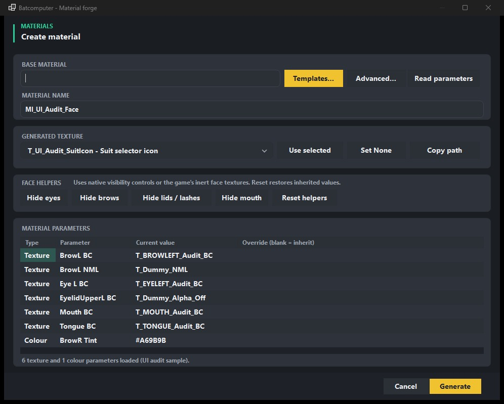
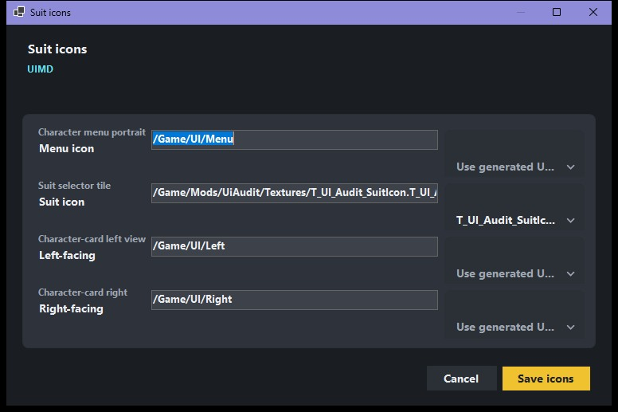

# Materials, textures, and faces

Batcomputer starts with **working game materials**. It copies a cooked material instance whose
parent and parameters already work in-game, then changes the supported values. This avoids guessing
at a cooked material layout.

## Materials

1. Select the target component and material slot.
2. Open **Materials** and choose a compatible game material or a tested template.
3. Read the donor parameters.
4. Override only the textures or colors you intend to change.
5. Generate the material and apply it to the slot.

Materials created by the tool are available across the current workspace. Use **Your materials**
for the current suit's set, or **All tool materials** to find and import one made for another suit.
Batcomputer keeps the cooked package and metadata together and prevents a rename or deletion that
would break another saved suit.

{ .bc-doc-shot loading=lazy }

A blank override inherits the donor value. **Set None** writes an intentional null/disabled value
where the template supports it; it is different from leaving the override blank.

{ .bc-doc-shot loading=lazy }

## Material families

Use templates as compatibility rules, not just visual presets:

- Character body materials.
- Fixed-color and recolorable accessories.
- Metallic plastic and cloth/cape materials.
- Standard `SK_LEGOface` materials.
- Special face rigs such as SuperheroFace.

Batcomputer warns when a selected template targets another mesh family. Do not force a standard
LEGOface recipe onto SuperheroFace, or the reverse, simply because both assets are faces.

## Faces

The face mesh and material topology must agree. Face helpers group hard-to-read parameters into
eyes, brows, lids, lashes, mouth/lower-face, and related regions.

For a Batman cowl that should use the Joker '89 lower-face print without visible eyes:

1. Keep the standard Batman `SK_LEGOface` mesh.
2. Start from the **Joker '89 lower-face print — no eyes** template.
3. Replace only the lower-face BC and normal textures with the Joker '89 donor textures.
4. Keep the Batman no-eyes values for eye regions.
5. Generate a new material and apply it to the Face slot.

The Joker '89 face mesh itself is a different target and is not a safe substitute for the standard
Batman face in this recipe.

{ .bc-doc-shot loading=lazy }

## Textures

Batcomputer records a cook profile with new texture entries. Select a profile that matches the use:

- Character/body color map.
- Color mask.
- Normal or packed material map.
- Native UI/suit icon.

Do not assume all images are color masks. The texture kind controls how the result is validated and
how materials consume it.

Current cook profiles write the full mip chain, including the small inline mips Unreal can select
when texture quality is lowered or the streaming pool is busy. A 2K character texture should carry
all twelve levels from 2048 through 1 pixel. **Epic** texture quality is not a fix for a broken cook;
it can simply keep one of the good larger mips resident and hide a bad lower level.

Use the normal-map profile for normals and the matching color, mask, or packed-map profile for the
other roles. Batcomputer uses filtered mip generation, preserves transparent UI edges, and
renormalizes filtered BC5 normals before compression.

### MMR packed maps

Use **Native 2K DXT1 MMR** for the game's metalness/roughness packed maps. This profile keeps the
native linear sampling metadata and all twelve mips from 2048 through 1 pixel. Its channels are:

- Red: metalness.
- Green: unused.
- Blue: roughness.

This is Batcomputer's proven native MMR template. It is verified in game on Electric at every
texture-quality setting.

Do not cook an MMR as a Character texture. Older projects may have saved an MMR that way because
names such as `CowlMMR` were not recognized. Right-click that texture, choose **Change cook
profile**, and select **Native 2K DXT1 MMR**. Batcomputer backs up the prior cook and changes the
saved texture role only after the native MMR recook succeeds.

### UI icons

Use the current verified native suit-icon profile. Old experimental BC7/DXT5 outputs may look
plausible in an extractor while decoding incorrectly in-game. After cooking:

1. Confirm the texture is present in the staged build.
2. Confirm FModel can display it at the expected path.
3. Test hover and selection in-game.

{ .bc-doc-shot loading=lazy }

### Existing legacy textures

Older tool-generated textures are rebuilt with the current complete-mip cooker when their saved PNG
and profile are available. Batcomputer will not package an old output it cannot prove belongs to the
current recipe. If the source PNG is missing or the project has no recorded profile, restore the PNG
and use **Change cook profile** before building.

## Color masks and Red Brick previews

Playable characters and modded suits with a usable body Color Mask can preview the base game's
Red Brick colours in the 3D viewer. This changes only the preview. Batcomputer does not create,
register, unlock, or package custom Red Bricks in this beta.
