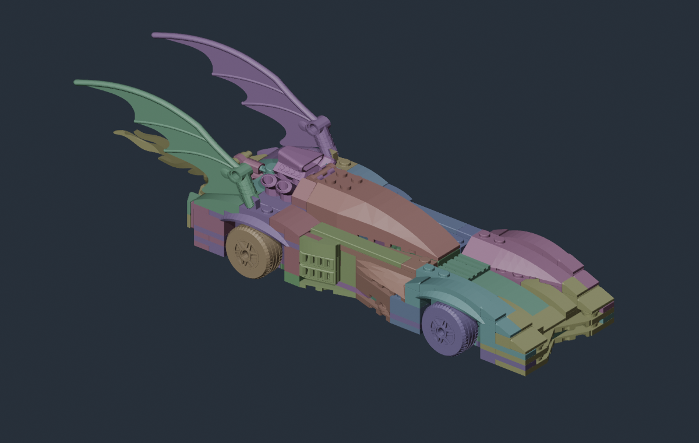
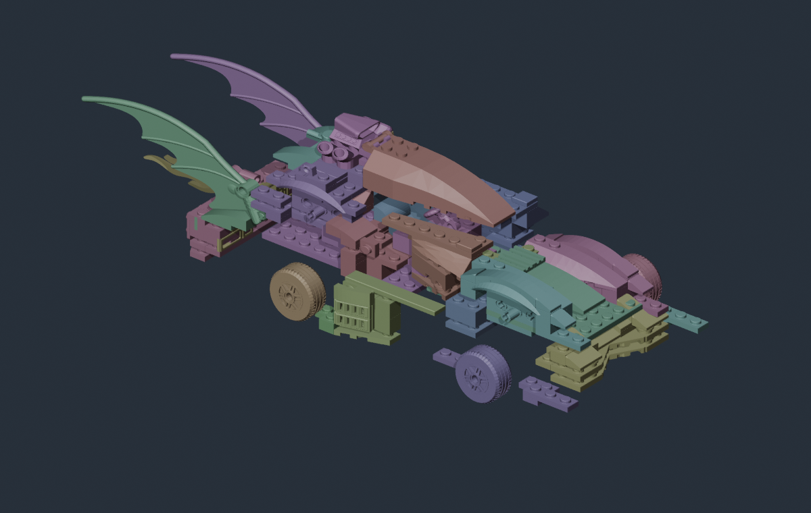

# Summon and parked vehicle models

A vehicle can have more than one visible model. Importing the driving body does not automatically create a LEGO assembly animation.

| Appearance | Asset used by the current Forever donor |
| --- | --- |
| Driving | Skeletal body on the 13-bone driving rig |
| Vehicle selection model | A separate menu actor that can reuse the driving body |
| Summoning/dismissing | Skeletal mesh on a separate 42-bone summon rig |
| Active car parked in the Batcave | An equipped actor with a summon component and its own mesh reference |

This covers the active parked car, not every display stand or thumbnail in the game.

!!! warning "Preparation guide, not an available importer"
    Custom summon and equipped-actor meshes are being tested separately. The current vehicle workshop does not have a summon-model import field. Finish the [normal driving-model workflow](vehicles.md) first. Do not import a summon FBX into its driving-body slot.

## Keep a second model copy

Keep the driving model and its rig unchanged. Duplicate the finished geometry into a separate collection for summon authoring. Both versions should match in their final assembled position, size, UVs and material slots so the transition does not visibly jump.

Preserve separate bricks or logical rigid subassemblies in the source file. A joined mesh can still contain disconnected pieces; that is fine. A fully welded shell is less useful if it must break into convincing individual assemblies. Separating a single continuous panel randomly can create visible cuts.

A useful source-file layout is:

```text
Reference
  Native driving mesh + rig
  Native summon mesh + rig
Driving
  Custom driving mesh + driving armature
Summon
  Custom rigid pieces + summon armature
```

Export one intended mesh/armature pair at a time. Do not export both rigs into the same FBX.

## Use the summon rig, not the wheel rig

The Forever summon reference is:

```text
/Game/Models/Vehicles/Summon/SK_VEH_Batmobile1995_BatmanForever_Summon
```

It binds to `SKEL_VEH_Batmobile1995_BatmanForever_Summon`. Its bones are not interchangeable with `Body`, `Wheel_FL` and the other driving bones.

Keep all 42 native bones, their names, hierarchy and rest transforms. Assign each whole piece **weight 1.0 to one summon bone**. Several pieces can share a bone and move as a group; a new bone for every brick is not required or supported by this native-rig experiment.

| Example group | Intended region in the Forever reference |
| --- | --- |
| `P05_Wheel_BR_PosY` | Back-right wheel assembly |
| `P06_Wheel_FR_PosY` | Front-right wheel assembly |
| `P07_Wheel_BL_NegY` | Back-left wheel assembly |
| `P08_Wheel_FL_NegY` | Front-left wheel assembly |
| `P01_Body_AxisNegZ` and other `P##_Body_…` bones | Rigid body groups; compare their geometry in the native reference |
| `Root` | Keep the hierarchy root; the native reference has no geometry weighted to it |

Do not rename the directional suffixes to adjust the look. The native summon system exposes bone-directed movement and per-part timing. This experiment retains its component, configuration and animation class rather than creating a new Blender animation clip. The final paths and timing still need in-game checks.

{ .bc-doc-shot loading=lazy }

*Blender illustration: colors identify rigid animation groups, not final materials. This example has 296 source pieces assigned to 32 of the 41 available non-root groups. All 42 bones remain in the exported rig.*

## Check the grouped copy

Move one group at a time in Blender Pose Mode. Whole pieces should move together without stretching. Check that wheels stay separate from body panels and that moving a canopy group does not pull neighboring geometry. Clear all temporary poses before export.

{ .bc-doc-shot loading=lazy }

*Illustrative offsets rendered in Blender. This is not a capture or simulation of the game's summon animation.*

A one-piece control can assign the entire model to a single non-root summon bone while retaining the full rig. It helps test mesh references and completion without evaluating a detailed build-up. It does not provide individual LEGO assembly behavior.

The test exporter preserves the earlier driving model's geometry and material palette while replacing its skin weights and rig for the summon copies. Its FBXs have been cooked against the native summon skeleton; the prepared `.blend` is an inspection copy, not a promise that any Blender FBX preset preserves the same bind transforms.

## What Batcomputer still needs to handle

The intended in-tool flow is: **validated driving body → optional summon-model import → assembled alignment check → grouped preview → build**. That summon portion is not implemented yet.

A complete implementation needs to cook and validate the second model, assign its materials, and update **both** the gameplay summon component and the active Batcave equipped actor. The native completion, mesh-swap and reverse/dismiss behavior must remain intact. Only changing the menu actor will not fix the parked car.

Until those tests pass, keep the normal driving recipe and summon source separate. An authored destruction/debris system, different collision rig, extra animated mechanical parts, display-stand replacements and custom 2D icons are separate work—not features supplied automatically by a summon mesh.
