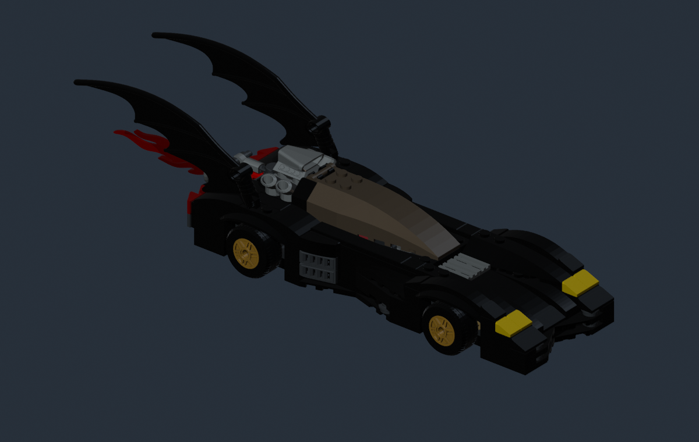
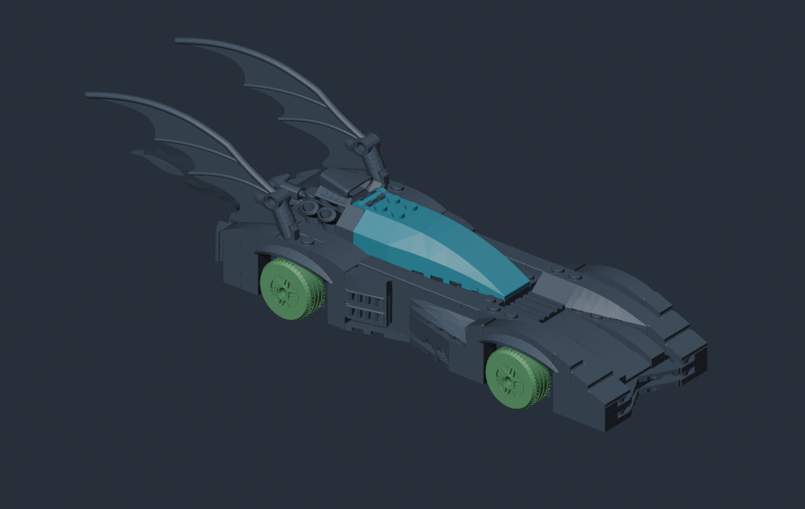

# Custom vehicles (experimental)

Make a separate selectable vehicle with a custom body, materials and editable attachment points. The current development build uses the **1995 Batman Forever Batmobile** as its driving base. Other donor rigs are not supported by this editor yet.

Start with the driving model. A LEGO build-up model is a separate asset with a different rig; see [summon and parked models](vehicle-summon-models.md) after the car drives correctly.

!!! warning "Development feature"
    Vehicles may not be available in the current public download. Native handling, collision and driving animations are retained. Moving the visible body or a seat does not rebuild the physics rig.

## 1. Get the reference

Configure the game files, mappings and UE 5.6 in [Settings](../getting-started/setup.md), then run a current full extraction if the vehicle donor files are missing.

1. Open **Vehicles → + New vehicle**.
2. In the workshop, open **Setup / body**. Set the name and owning character. Renaming keeps the vehicle's saved ID.
3. Open **Body materials → Import / edit rigged FBX…**.
4. Choose **Export native reference + rig (GLB)…**. Import that GLB into Blender as the donor reference.
5. Save your own `.blend` copy. Keep the donor in a separate reference collection and do not export its geometry with the custom model.

Keep the donor's bone names, hierarchy, rest transforms and scale. Fit the mesh to the rig, not the rig to the mesh. Do not use automatic bone reorientation on the reference.

## 2. Fit the car in Blender

{ .bc-doc-shot loading=lazy }

*Blender Workbench render of a prepared example. This is not an in-game material preview.*

Match these before adding details:

- **Wheel centers:** line up each tire and rim with its donor wheel pivot. The center of the visible wheel must be the center it rotates around.
- **Wheel size and ground contact:** stay close to the donor. A larger visible tire does not increase the physics wheel radius.
- **Body:** fit around those wheels. Check width, wheel arches and clearance from the ground.
- **Canopy and steering wheel:** align any moving pieces with their existing hinges/pivots.
- **Cockpit:** leave room for driver and passenger. The workshop can offset seats, but it cannot invent new entry animations or change the collision shape.

Use front, side and top views. Left/right always mean the vehicle's own left/right, not the side of the screen. Do not copy a scene-scale number from another Blender file: compare against the imported donor in the same scene.

## 3. Assign rigid weights

Most of the car is rigid. Give each complete LEGO piece **weight 1.0 to one bone**, with no weight on other bones. Automatic weights can make a panel bend or follow a nearby wheel.

For a new unweighted model, select the mesh and then the armature, and use **Parent → Armature Deform → With Empty Groups**. In mesh Edit Mode, select a complete piece, choose its bone-named vertex group, set Weight to `1.000`, and assign it. Remove conflicting bone-group weights. Existing correctly weighted models do not need parenting again. See [Blender's armature parenting guide](https://docs.blender.org/manual/en/5.0/animation/armatures/skinning/parenting.html).

{ .bc-doc-shot loading=lazy }

*Illustration colors: blue-gray = Body, green = rotating wheels, cyan = Canopy. Interior steering and non-spinning wheel mounts also have their own assignments. These colors are not exported material requirements.*

### Batman Forever driving rig

| Bone | What belongs here |
| --- | --- |
| `Body` | Fixed body panels, bumpers, fixed windows, light lenses and fixed exhaust pieces. |
| `Wheel_FL`, `Wheel_FR` | Front-left and front-right rotating tires/rims. |
| `Wheel_BL`, `Wheel_BR` | Back-left and back-right rotating tires/rims. `B` means back, not brake. |
| `Canopy` | The opening canopy and anything that should open with it. |
| `SteeringWheel` | The interior steering wheel. |
| `ChassisAttach_FL`, `ChassisAttach_FR`, `ChassisAttach_BL`, `ChassisAttach_BR` | Non-spinning wheel-mount pieces where appropriate. Compare the donor; do not use these for the tires. |
| `Root`, `Chassis` | Preserve these hierarchy bones. Do not give them arbitrary weights just to fill every group. |

There are 13 native driving bones. Every exported vertex needs a valid assignment, but every bone does **not** need weighted geometry.

In Pose Mode, test one wheel, the steering wheel and the canopy separately. A wheel should spin around its center without pulling bodywork. A canopy should open without stretching. Clear the test pose before export; do not apply it as a new rest pose.

## 4. Split material and light regions

Give areas that need different materials separate material slots: body paint, glass, tires, metal, lenses and accents. Slots describe surfaces; vertex groups describe how those surfaces move. They do different jobs.

For a lens that should inherit native light behavior, use a **lens-only material slot**, entirely weighted to `Body`. Helpful names include:

| Suggested slot name | Workshop role |
| --- | --- |
| `BC_Headlight_L`, `BC_Headlight_R` | Left/right headlights |
| `BC_BrakeLight_L`, `BC_BrakeLight_R` | Left/right brake lights |
| `BC_RearLight_L`, `BC_RearLight_R` | Left/right rear lights |
| `BC_Accent_01` through `BC_Accent_04` | Accent channels 1–4 |

These are **material slot names, not extra bones**. The names suggest roles; confirm them in the workshop. Each role and slot can be assigned once. Combine lenses that should share one role into the same slot. Moving-bone lenses and sections with 65,535 or more vertices are currently rejected.

Keep painted or permanently visible exhaust/flame geometry on its appropriate body bone. That alone does not make it appear only while boosting. The boost particle outlet is a separate attachment point.

## 5. Export and import the driving FBX

Export only the custom mesh and its complete donor armature as a **binary FBX**. Leave out reference meshes, lights, cameras and unrelated rigs. Disable extra leaf/end bones and animation baking. Keep all required native bones, including unweighted hierarchy bones. Preserve UVs and material slots.

Use unit and axis settings that preserve the donor rest pose. A GLB-to-Blender-to-FBX round trip can change bone axes or introduce an extra root; looking correct in the viewport is not enough. Import a small trial first. Batcomputer checks the cooked hierarchy and rest transforms against the actual game rig. If that fails, fix the export rather than renaming bones or moving the rig until it passes. **FBX unit correction** is for a known unit mismatch, not a general alignment slider.

Back in the import window:

1. Choose **Import / replace weighted FBX…** and wait for validation.
2. Assign a valid cooked material to every slot. Blender materials do not become game shaders automatically.
3. Inspect the deformation preview, then choose **Use skinned mesh**.
4. Apply the setup and return to the vehicle workshop.

**Reimport saved FBX** cooks Batcomputer's saved copy. To bring in new Blender edits, choose **Import / replace weighted FBX…** and select the new export.

## 6. Finish in the 3D workshop

- **Materials:** click a surface and choose its slot. The picker includes Generated, Vehicle materials, Vehicle part materials and Base game. Use **Copy / recolor…** for a private editable material. Glass and emission require suitable shaders; a flat color is not a substitute.
- **Light surfaces:** select the lens slot and its **Light behavior**, or use **Use named light slots**, then review the assignments. This reuses existing native lamp controllers, not a new lighting system.
- **Assembly:** position decorative parts and native light sources. Lens/glow geometry and the beam source are separate, so check both when moving a lamp. Preview hiding is not the same as removing a part from the build.
- **Seats:** enable **Seated figures** and position driver/passenger. The preview uses native seated poses for The Batman 2025 and default Catwoman. It does not simulate driving hand adjustments, entry/exit or cape movement.
- **Weapons:** position the native launcher and grapple attachment markers. These move the existing attachment points; they do not add weapon slots or change damage.
- **Boost:** position and rotate the boost/exhaust outlet. The Forever marker uses the effect's local +Z direction. It shares the native outlet behavior; independent boost-color authoring is not implemented.

The workshop uses vehicle axes: **X = forward/back, Y = left/right, Z = up/down**. Part axes rotate with the selected part. Materials and glow are approximate previews; check final appearance in-game.

Choose **Save vehicle** to keep the workshop edits.

## 7. Add it to a mod

Select the target mod, open **Vehicles → Manage vehicles in mod**, check the vehicle and choose **Save selection**. A saved vehicle that is not enabled in the mod will not be packaged. A saved custom-character owner is included automatically when needed.

Build through the normal [build and sharing flow](build-test-share.md). Install the complete release bundle, including its registry plugin and tag configuration—not just the `.pak` file.

Check selection, steering, wheel rotation, boost, firing/grapple, both seats, canopy movement and returning to the Batcave. Restart with the vehicle equipped. Also verify that the original donor still works. Keep source art and vehicle project files for later edits; avoid shipping extracted native reference files as authoring samples.

## Driving versus parked and summon appearance

The normal body import changes the driving model and vehicle menu model. The active car parked in the Batcave can use a separate summon mesh, so replacing the body does not cover every presentation actor. A shelf/display car or 2D thumbnail can be another asset again.

The grouped summon/parked replacement is a separate experiment, not a second import button in the current workshop. Read [summon and parked models](vehicle-summon-models.md) for the preparation flow and current limits.
