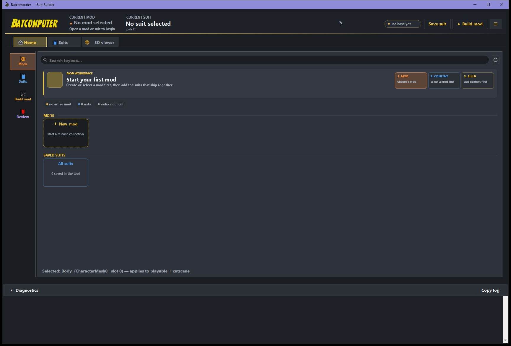
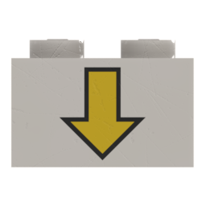
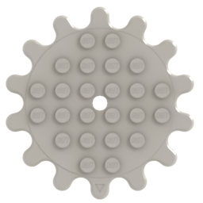
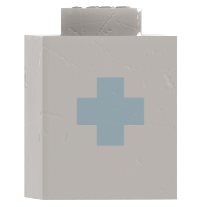
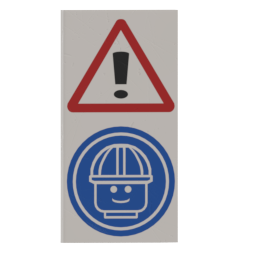

# Batcomputer

Batcomputer is a Windows tool for creating playable suit mods for
*LEGO Batman: Legacy of the Dark Knight*. It uses assets extracted from your own game, creates the
metadata the game needs, and packages the finished mod for Loomirr's LOTDK UE4SS.

{ .bc-doc-shot loading=lazy }

!!! info "Public beta"
    The current build is **0.9.0-beta.7**. Suit creation and packaging work in-game, but the project
    remains in public beta. Back up your projects, and include copied diagnostics when reporting a
    repeatable problem.

## Start here

<div class="grid cards" markdown>

-   <span class="bc-card-heading"> <strong>Install Batcomputer</strong></span>

    ---

    Unpack the portable build and check what you need before making a mod.

    [Installation guide](getting-started/install.md)

-   <span class="bc-card-heading"> <strong>Complete first-time setup</strong></span>

    ---

    Configure mappings, the game Paks folder, UE 5.6, and the first character extraction.

    [Setup guide](getting-started/setup.md)

-   <span class="bc-card-heading"> <strong>Create a suit</strong></span>

    ---

    Start a mod, choose visual and gameplay donors, customize the character, and test it.

    [First-suit tutorial](guides/first-suit.md)

-   <span class="bc-card-heading"> <strong>Solve a problem</strong></span>

    ---

    Work through common setup, viewer, build, menu-discovery, and texture problems.

    [Troubleshooting](help/troubleshooting.md)

</div>

## What Batcomputer builds

- Playable and cutscene character Blueprints based on game characters.
- Character parts, materials, textures, equipment, gliders, and compatible animation data.
- Custom static-mesh attachments imported from OBJ files.
- PawnTag, DCMD, UIMD, StringTable, gameplay-tag configuration, and Asset Registry data.
- One or more suits in a single mod.
- A local test installation and an installable ZIP.

## What it does not include

Batcomputer does not include game files, extracted assets, mappings, the proprietary Oodle runtime,
Unreal Engine, or Loomirr's LOTDK UE4SS. You provide those files from your own installations;
players only need Loomirr's LOTDK UE4SS and the finished mod.

## Basic steps

```text
Install → Set up → Extract/index → Create mod → Add suit → Customize
        → Check → Build/install → Cold-launch test → Create release ZIP
```

Continue with [Requirements](getting-started/requirements.md).
