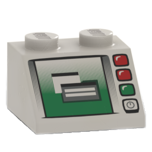

# Batcomputer

Batcomputer is a Windows modding tool for *LEGO Batman: Legacy of the Dark Knight*.
Create suits, change equipment, and build new playable characters from assets in your own game.
Batcomputer handles the files and registration needed to package and install your mod.

{ .bc-doc-shot loading=lazy }

!!! success "Batcomputer 1.0 is here"
    Get the [official 1.0 release](https://github.com/Loomirr/Batcomputer/releases/tag/v1.0.0),
    or use the built-in updater if your version supports it. These guides cover 1.0;
    experimental features are marked on their own pages. Keep a backup before upgrading.

## Start here

New to modding? Start with a simple suit before replacing rigs or mixing gameplay systems.
Already making mods? Jump to [custom characters](guides/custom-characters.md),
[custom equipment](guides/equipment-workshop.md), [vehicles](guides/vehicles.md),
or the [Blender rig walkthrough](guides/blender-rig-preparation.md).

<div class="grid cards" markdown>

-   <span class="bc-card-heading"> <strong>Install Batcomputer</strong></span>

    ---

    Unpack the portable build and check what you need before making a mod.

    [Installation guide](getting-started/install.md)

-   <span class="bc-card-heading"> <strong>Complete first-time setup</strong></span>

    ---

    Configure mappings, the game Paks folder, UE 5.6, and the first character extraction.

    [Setup guide](getting-started/setup.md)

-   <span class="bc-card-heading"> <strong>Create a suit</strong></span>

    ---

    Start a mod, choose visual and gameplay donors, customize the character, and test it.

    [First-suit tutorial](guides/first-suit.md)

-   <span class="bc-card-heading"> <strong>Solve a problem</strong></span>

    ---

    Work through common setup, viewer, build, menu-discovery, and texture problems.

    [Troubleshooting](help/troubleshooting.md)

-   <span class="bc-card-heading"> <strong>Update an older suit</strong></span>

    ---

    Refresh the current dump, rebuild the part index, and safely rebase a suit without starting
    over.

    [Update or repair a suit](guides/update-repair-suit.md)

-   <span class="bc-card-heading"> <strong>Get a quick answer</strong></span>

    ---

    Find the short version on bases, dumps, capes, custom meshes, builds, and sharing mods.

    [Frequently asked questions](reference/faq.md)

</div>

## What Batcomputer builds

- Playable and cutscene character Blueprints based on game characters.
- Character parts, materials, textures, equipment, gliders, and compatible animation data.
- Visual bases from playable, cutscene, and supported `_Quest` character assets.
- Verified native cape/glider pairs on compatible gameplay donors while keeping their normal
  appearance and playstyle.
- Custom static-mesh attachments imported from OBJ files.
- Weighted FBX replacements on supported native rigs, including character bodies and parts.
- Independent characters with their own default suit, extra suits, symbols and mode choices.
- Experimental custom equipment and vehicles using native gameplay setups.
- PawnTag, DCMD, UIMD, StringTable, gameplay-tag configuration, and Asset Registry data.
- One or more suits in a single mod.
- A local test installation and an installable ZIP.
- Editable creator archives for handing a project to another modder.

## New and updated guides

- [Change a character's pawn-tag family](guides/character-identity.md) without renaming its project or display name.
- [Choose the right donors](guides/choosing-donors.md), including Joker, Harley and NPC visuals.
- [Import/Export](guides/import-export.md): which ZIP to give players and which to give creators.
- [Review your edits](guides/review-changes.md) before building.
- [Settings and performance](reference/settings.md): path indicators, preview quality and cleanup.
- [Update and recover Batcomputer](guides/app-updates.md), or [move your workspace safely](guides/backups-and-moving.md).

## What it does not include

Batcomputer does not include game files, extracted assets, mappings, the proprietary Oodle runtime,
Unreal Engine, or Loomirr's LOTDK UE4SS. You provide those files from your own installations;
players only need Loomirr's LOTDK UE4SS and the finished mod.

## Basic steps

```text
Install → Set up → Extract/index → Create mod → Add suit → Customize
        → Check → Build/install → Cold-launch test → Create release ZIP
```

Continue with [Requirements](getting-started/requirements.md).
